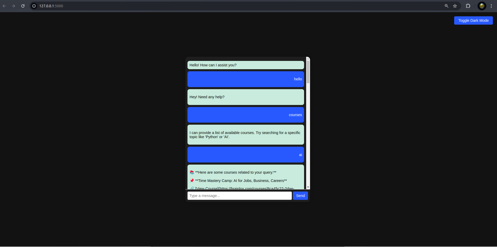

# LangChain Chatbot

This is a Flask-based chatbot that leverages LangChain and ChromaDB to provide AI-driven conversational responses. The chatbot extracts data from Brainlox courses, creates embeddings stored in a vector database, and serves responses via a RESTful API.

## Features
- Extracts course data using `data_loader.py` and `selenium_script.py`.
- Creates embeddings with `embedding_store.py`.
- Stores embeddings in ChromaDB.
- Query handling via `query_engine.py`
- Implements a Flask RESTful API in `app.py`.
- Frontend designed using HTML, CSS, and JavaScript (`script.js`).
- Tested using Postman.


## Installation
### Prerequisites
Ensure you have Python 3.8+ and pip installed.

### Steps
1. Clone this repository:
   ```bash
   git clone <repo_url>
   cd langchain-chatbot
   ```
2. Create a virtual environment:
   ```bash
   python -m venv venv
   source venv/bin/activate  # On Windows, use `venv\Scripts\activate`
   ```
3. Install dependencies:
   ```bash
   pip install -r requirements.txt
   ```
4. Run the Flask server:
   ```bash
   python app.py
   ```
5. Access the chatbot frontend at `http://127.0.0.1:5000`.

## API Endpoints
### `POST /query`
- **Request Body:**
  ```json
  {"query": "What is AI?"}
  ```
- **Response:**
  ```json
  {"response": "AI stands for Artificial Intelligence..."}
  ```

## Frontend
The chatbot UI is styled using CSS and managed with `script.js` for interactive responses. It supports:
- User input handling
- API requests to Flask backend
- Dynamic response rendering

## Troubleshooting

- If `chromadb` is not found, try `pip install chromadb`.
- If Flask API doesn’t start, ensure you activated the virtual environment.
- If embeddings are not loading, check if `embedding_store.py` ran successfully.

## Contribution Guidelines

We welcome contributions! To contribute:

1. Fork the repository.
2. Create a new branch (`feature-branch-name`).
3. Commit your changes and push the branch.
4. Submit a pull request.

## Demo Screenshot




## Requirements
The required dependencies for this project are listed in `requirements.txt`:
```
Flask
langchain
chromadb
selenium
requests
beautifulsoup4
torch
tqdm
```  
Ensure all dependencies are installed before running the project.

## License
MIT License.

